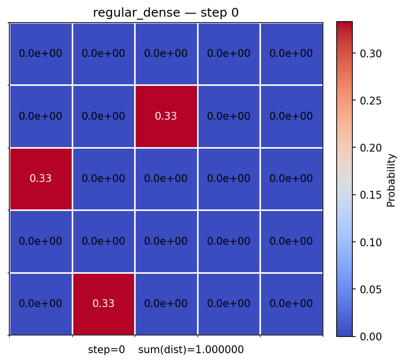
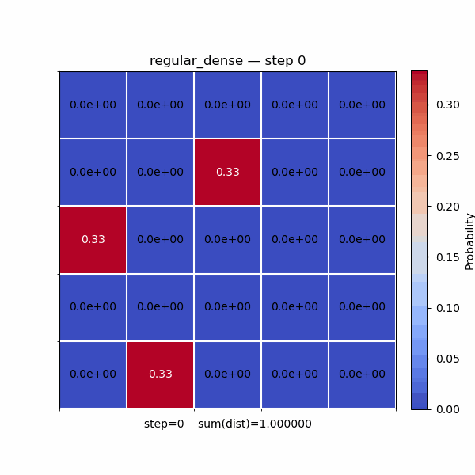
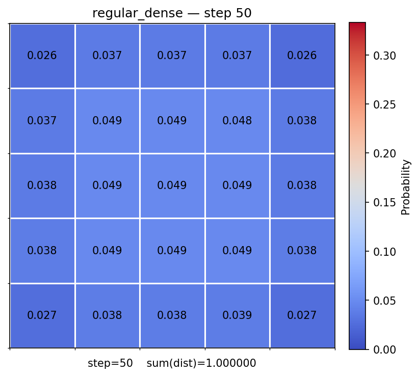
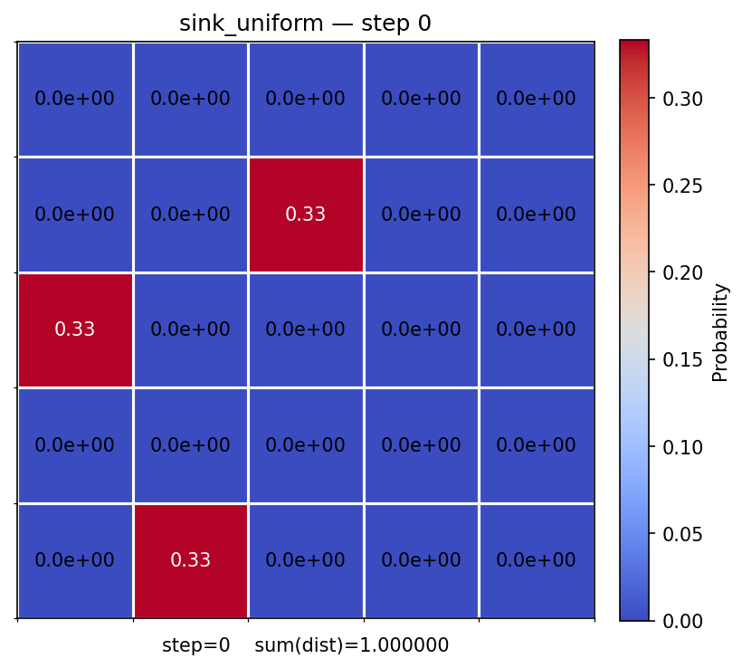
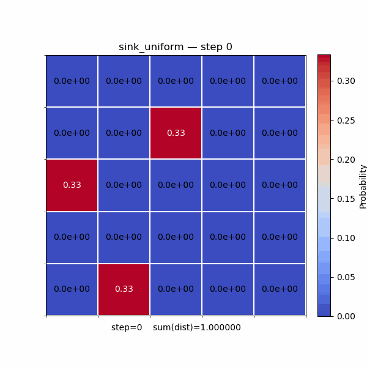
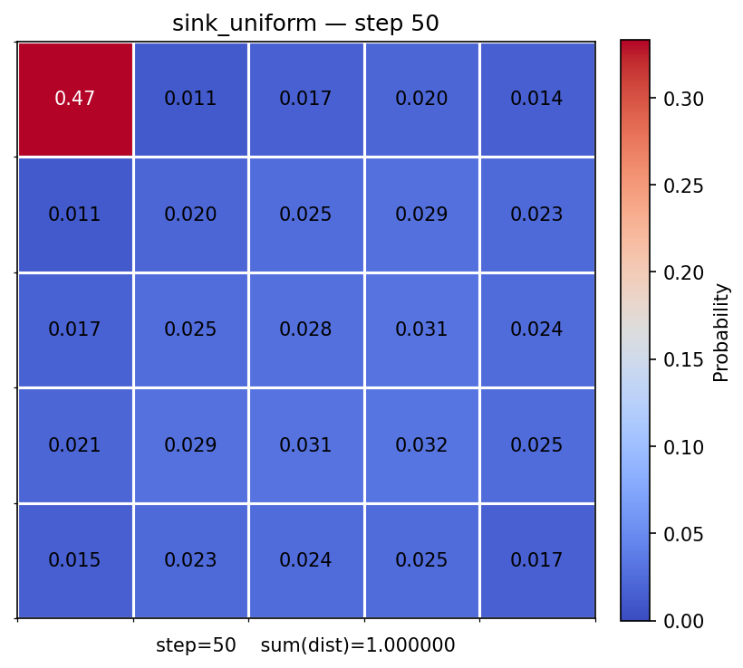

# 5×5 Gridworld — Markov Transition Visualisations

Two transition matrices applied to an initial state distribution over 50 time-steps.

---

## 2. Regular Stochastic Matrix

All entries strictly > 0, so every state is reachable from every other.


```text
⎡0.60  0.20  0.10  0.05  0.05⎤
⎢0.15  0.55  0.15  0.10  0.05⎥
⎢0.05  0.15  0.60  0.15  0.05⎥
⎢0.05  0.10  0.15  0.55  0.15⎥
⎣0.05  0.05  0.10  0.20  0.60⎦
```

### Start (step 0)




### Animation



### End (step 50)



--- 
## 2.Sink Matrix

- **Sink** at cell (0, 0) — once probability enters, it never leaves.


```text
⎡1.00  0.00  0.00  0.00  0.00⎤   ← sink state (absorbing)
⎢0.40  0.20  0.40  0.00  0.00⎥
⎢0.00  0.40  0.20  0.40  0.00⎥
⎢0.00  0.00  0.40  0.20  0.40⎥
⎣0.00  0.00  0.00  0.80  0.20⎦
```


### Start (step 0)




### Animation



### End (step 50)




